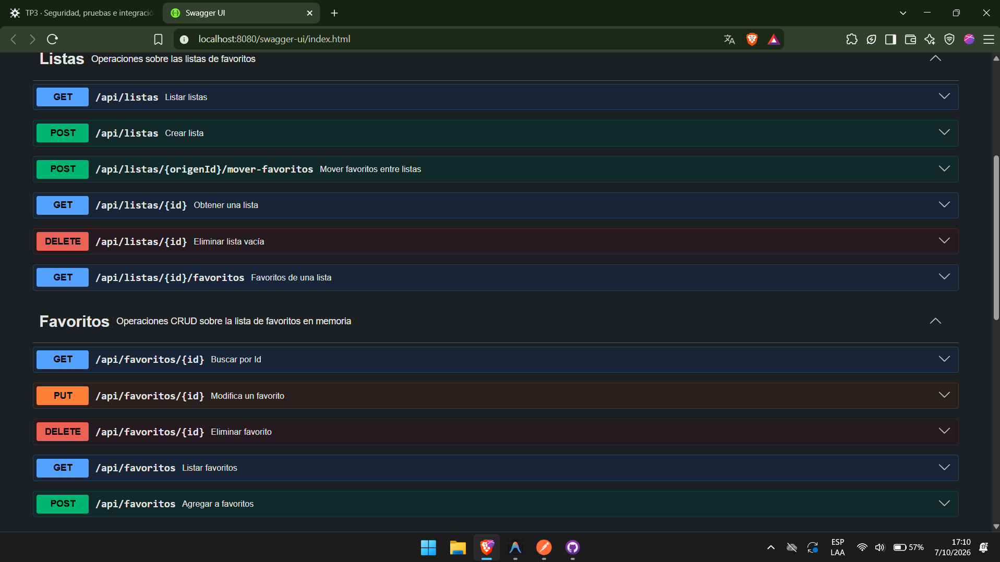
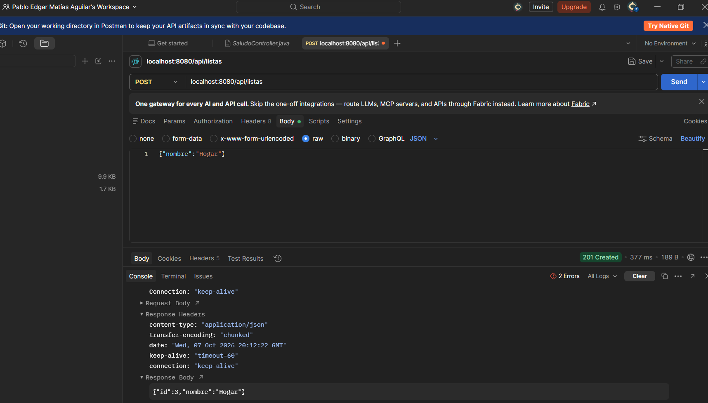
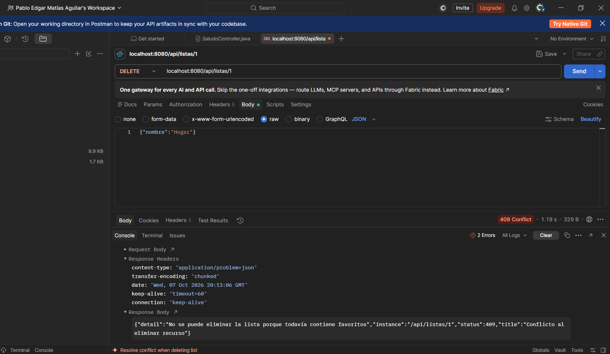

# TP1 · Spring Boot, API REST y arquitectura en capas

Punto de partida del práctico. Está armada la **configuración e
infraestructura transversal** que van a necesitar sin importar cómo
resuelvan cada consigna; lo que falta —el diseño y la lógica propia de cada
recurso— se va a ir sumando a esta rama a medida que avance la cursada.

## Cómo levantar el proyecto

Requiere Java 25. Usar siempre el wrapper, nunca un `mvn` instalado aparte:

```
# Windows
.\mvnw.cmd spring-boot:run

# macOS/Linux
./mvnw spring-boot:run
```

Cuando el log muestre `Started DemoApplication`, la app queda escuchando en
`http://localhost:8080`.

Para compilar y correr los tests: `./mvnw test` (o `.\mvnw.cmd test`).

## Endpoints disponibles hoy

| Método | Path | Qué hace |
|---|---|---|
| GET | `/health` | Chequeo de salud básico |
| GET | `/ping` | Devuelve `pong`, sin JSON — otro chequeo trivial |

```
curl http://localhost:8080/health
curl http://localhost:8080/ping
```

## Qué ya está armado

- **`config/RestClientConfig`**: bean de `RestClient` apuntado a la
  `base-url` de DummyJSON (`app.dummyjson.base-url` en
  `application.properties`). Listo para inyectar.
- **`config/OpenApiConfig`**: metadata general de Swagger UI.
- **`client/dummyjson/DummyJsonProducto` y `DummyJsonProductosResponse`**:
  la forma exacta del JSON que devuelve `https://dummyjson.com/products` —
  para no tener que adivinar los nombres de campo del proveedor externo.
- **`exception/GlobalExceptionHandler`** (+ `RecursoNoEncontradoException` y
  `ServicioExternoException`): manejo uniforme de errores para toda la API
  (`ProblemDetail`). Ya contempla 404 y errores de un servicio externo —
  se reusa tal cual para cualquier recurso nuevo que se agregue.

## Qué falta (eso es la consigna)

- Un cliente propio (`DummyJsonClient` o como se llame) que use el
  `RestClient` ya configurado para llamar a `/products` y `/products/{id}`,
  manejando los errores de red/HTTP con las excepciones ya definidas.
- Un DTO propio para el producto (no el JSON externo tal cual) y el
  service/controller de `/api/productos`.
- Todo el recurso de favoritos: entidad, repository en memoria, DTOs,
  service y controller CRUD.
- Anotar los controllers con `@Tag`/`@Operation` para que Swagger UI los
  documente.

## Dependencias

- `spring-boot-starter-webmvc` — Spring MVC + Tomcat embebido.
- `spring-boot-starter-validation` — Bean Validation (`@NotNull`, `@NotBlank`, ...).
- `springdoc-openapi-starter-webmvc-ui` — Swagger UI / OpenAPI.

## Arquitectura Hexagonal: Puertos y Adaptadores (TP2)

Se migró la persistencia en memoria, quedando esta obsoleta y pasando a utilizarse PostgreSQL.

Las clases que no cambiaron fueron: `FavoritoController`, `FavoritoService`, el modelo de dominio `Favorito`, el puerto `FavoritoRepository` y los DTOs (`CrearFavoritoRequest`, `FavoritoResponse`).
Las clases que se incorporaron son: `FavoritoEntity` (entidad JPA), `FavoritoJpaRepository` (Spring Data) y `FavoritoRepositoryAdapter` (adaptador).
La clase `FavoritoRepositoryMemoria` quedó obsoleta.

### Justificación
Esto fue posible porque `FavoritoRepository` actúa como un **puerto** (un contrato). Entonces, terminamos aplicando el principio SOLID de inversión de dependencias. Y tanto `FavoritoRepositoryMemoria` como `FavoritoRepositoryAdapter` son **adaptadores** del puerto `FavoritoRepository`, permitiendo que el servicio de negocio no dependa de los detalles técnicos de almacenamiento. Esto hace que el sistema sea más flexible y mantenible.  

## Modelado Relacional: Listas y Favoritos (Punto 5)

### 1. Relación uno a muchos (@ManyToOne) Unidireccional
Se vinculó la entidad `FavoritoEntity` con `ListaEntity` mediante una relación `@ManyToOne` en la columna `lista_id`.
- **¿Por qué unidireccional?** Se evitó colocar `@OneToMany` en `ListaEntity` para evitar complejidades de carga perezosa (*lazy loading*), sobrecarga de memoria y posibles referencias circulares al serializar JSON.
- **¿Cómo se obtienen los favoritos de una lista?** Se resolvió mediante una consulta derivada de Spring Data JPA: `findByListaId(Long listaId)` en `FavoritoJpaRepository`.

### 2. Dominio y DTOs desacoplados
Tanto el modelo de dominio `Favorito` como los DTOs (`CrearFavoritoRequest` y `FavoritoResponse`) referencian a la lista únicamente mediante su identificador numérico (`Long listaId`), sin cargar el objeto completo `Lista`. Esto preserva el aislamiento del dominio.

### 3. Protección de Integridad Referencial (409 Conflict)
En `ListaService`, antes de eliminar una lista se verifica si posee favoritos asociados mediante el repositorio. Si la lista no está vacía, se lanza `ListaNoVaciaException`, la cual es capturada por `GlobalExceptionHandler` respondiendo un estado HTTP `409 Conflict`, evitando errores de integridad en la base de datos (500).

## Evolución del Esquema (Punto 6)
Esto se resuelve mediante una migración nueva (`V4`) y no editando `V3` porque en entornos reales y en Flyway las migraciones son **aditivas e inmutables**. Modificar un script ya aplicado rompería la validación de checksum en bases de datos existentes en producción. La evolución incremental permite transformar datos existentes (backfill) antes de aplicar restricciones destructivas como `NOT NULL` sin pérdida de información ni tiempo de inactividad.

## Transacciones y Atomicidad (Punto 7)

La operación `POST /api/listas/{origenId}/mover-favoritos` reasigna los favoritos a una nueva lista y elimina la lista origen. Este método está anotado con `@Transactional` en `ListaService`, respetando la 'A' en ACID de las transacciones.

### Justificación teórica (ACID)
En términos de **Atomicidad**, la operación debe comportarse como una unidad indivisible: "todo o nada". 
Si removiéramos `@Transactional` y una falla ocurriera a mitad de camino (por ejemplo, después de actualizar los favoritos pero antes de eliminar la lista de origen):
- Las reasignaciones quedarían confirmadas de manera parcial en la base de datos.
- La lista origen quedaría vacía pero sin eliminarse, o en un fallo intermedio unos favoritos pertenecerían a una lista y otros a otra.
Con `@Transactional`, Spring y PostgreSQL garantizan que si cualquier escritura o validación falla, se produce un **rollback** automático, devolviendo el estado de la base de datos exactamente al punto previo al inicio de la operación.

## Evidencias de Ejecución

### Swagger UI


### Caso de Exito: Postman, al agregar una lista de favoritos


### Caso de Error: 409 Conflict al borrar lista con favoritos

